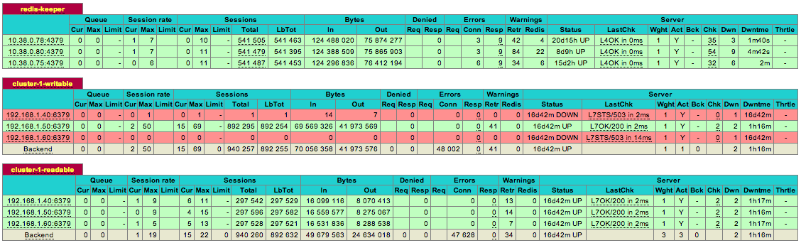

Redis-Keeper
----
Redis-Keeper is a distributed system that monitors and performs auto-failover to multiple Redis clusters.

**It is designed to work with any client/language.**

----

##### What about Redis Sentinel?
Similarly to redis-sentinel it is also an external process that checks the healthy state of each redis server, and might auto assign a new master in case of failures. It is also designed to run in multiple nodes to present a safer[1] view of the system.

The difference is on the way those external processes reach a consensus, and how clients get in sync with the current state of the system.

----

[1] Network partition is something that redis-sentinel is proven not to handle quite well, and that i'll try to improve on the next versions of redis-keeper. Even so, keep in mind that a strict CP system is not the goal of this project.

To get more info on redis-sentinel under network partition: [Jepsen redis-sentinel test](http://aphyr.com/posts/283-call-me-maybe-redis) and [Antirez reply](http://antirez.com/news/55)

----

### How it Works:

When the redis-keeper service starts, it will elect one of the online instances as a coordinator Leader. The leader's job is to detect when the majority of the system marked a Redis as down, and to trigger a failover process to handle it.
It is built using [ZooKeeper](http://zookeeper.apache.org/).

When the Leader starts up, it will try to automatically identify the Redis cluster configuration (roles, status), and do some role reconfiguration if needed (like multiple redis master).

##### What happen when a redis instance goes down?
Eventually the majority of online redis-keepers will detect that the redis instance is down (this may take few seconds, depending on the configuration, more below). 

Only then the Leader will act, updating the node status, and triggering a failover process if the node that went down had a master role. 

This failover process looks for the best [2] surviving slave, and promotes it to master (also updating the other slaves to point to the new master). In case of no good slave available, the failover process will fail, and the redis cluster will stay down until a good node is available to become the master.

The leader also takes care of updating the cluster status on ZooKeeper, so that clients receive the changes.

----

[2] Choosing the best slave can be tricky, currently we choose the one with highest uptime, which is not optimal, on future versions we will use the replication offset available on redis 2.8.

----

### Clients 

The project supports a generic approach to the client. Using a rest api, it supports [HAProxy](http://haproxy.1wt.eu/) as a proxy to the proper redis instance.

Hence, it is language and client independent, and the performance loss is acceptable for most cases(20% loss in our tests).
A ZooKeeper based client is on the queue for future versions, to achieve maximum performance.

Currently we recommend running a local haproxy service, and connecting your process to the local haproxy port.
See [sample configuration](#haproxy-sample-configuration) for more details on how to configure haproxy.

----

### Configuration
```json
{
  "keeper-id": "keeper-1",
  "zk-quorum": ["zknode1.dev:2181", "zknode2.dev:2181"],
  "zk-prefix": "/rediskeeper",
  "rest-port": 46379,
  "tick-seconds": 1,
  "failover-tick-seconds": 10,
  "seconds-mark-down": 5,
  "clusters": [
    {
      "name": "cluster-1", 
      "nodes": [
        {"host": "192.168.1.40", "port": 6379},
        {"host": "192.168.1.50", "port": 6379},
        {"host": "192.168.1.60", "port": 6379},
      ]
    },
    {
      "name": "cluster-2",
      "nodes": [
        {"host": "192.168.2.40", "port": 6380},
        {"host": "192.168.2.50", "port": 6380},
        {"host": "192.168.2.60", "port": 6380},
        {"host": "192.168.2.70", "port": 6380},
      ]
    }
  ]
}
```

- `keeper-id`: Unique id used for this redis-keeper(required to be unique across instances)
- `zk-quorum`: list of zookeeper servers
- `zk-prefix`: zookeeper prefix
- `rest-port`: port to be used on the rest api
- `tick-seconds`: seconds between redis health checks
- `failover-tick-seconds`: seconds between failover checks/execution
- `seconds-mark-down`: seconds that a redis node can stay inaccessible before being marked as down
- `clusters`: list of clusters to be monitored, each cluster has a unique name, and a unique list of redis servers.

#### HAProxy sample configuration:

```conf
# Redis-Keeper (cause redis-keeper must be high-available too)
frontend redis-keeper
  # this will be used internally to check nodes roles
  bind *:4380 
  default_backend redis-keeper

backend redis-keeper
  mode http
  balance roundrobin
  # Configuring all redis-keeper:
  server 192.169.1.1:4379 192.169.1.1:4379 check
  server 192.169.1.2:4379 192.169.1.2:4379 check
  server 192.169.1.3:4379 192.169.1.3:4379 check
```

```conf
# Cluster 1 writable(redis master)
frontend cluster-1-writable
  mode tcp # required for redis
  # your client should use this port to connect to the master
  bind *:1301
  default_backend cluster-1-writable

backend cluster-1-writable
  mode tcp # required for redis
  balance static-rr

  # need this to haproxy send node info to redis-keeper
  http-check send-state 

  # override haproxy check, it is important to use correct cluster name on url
  option httpchk GET /cluster/cluster-1/is-writable HTTP/1.1\r\nHost:\ localhost

  # all redis server in this cluster, must use same name as configured on redis-keeper.
  # also change check address to use redis-keeper haproxy port
  server 192.168.1.40:6379 192.168.1.40:6379 check inter 10s addr 127.0.0.1 port 4380
  server 192.168.1.50:6379 192.168.1.50:6379 check inter 10s addr 127.0.0.1 port 4380
  server 192.168.1.60:6379 192.168.1.60:6379 check inter 10s addr 127.0.0.1 port 4380
```

```conf
# Redis readable cluster-1 (in case you want to read from slaves too):
frontend cluster-1-readable
  mode tcp
  # your client can access this port to read from any online nodes (slaves + master):
  bind *:9301 
  default_backend cluster-1-readable

backend cluster-1-readable
  mode tcp
  balance static-rr
  http-check send-state

  # Pretty much the same configuration from the writable backend, only the url changes
  option httpchk GET /cluster/cluster-1/is-readable HTTP/1.1\r\nHost:\ localhost

  server 192.168.1.40:6379 192.168.1.40:6379 check inter 10s addr 127.0.0.1 port 4380
  server 192.168.1.50:6379 192.168.1.50:6379 check inter 10s addr 127.0.0.1 port 4380
  server 192.168.1.60:6379 192.168.1.60:6379 check inter 10s addr 127.0.0.1 port 4380
```



----

### Using:
You can get the latest version at: [Download 0.1](https://github.com/rodrigopr/redis-keeper/releases/download/v0.1/redis-keeper-0.1-bin.zip).
To start the system, execute: `bin/redis-keeper.sh conf/keeper.conf`

##### To build from source(maven required): 
```bash 
git clone http://github.com/rodrigopr/redis-keeper.git
cd redis-keeper
mvn clean compile package
```

It will produce a .zip package in `target/`.

The tests require redis-server to be installed on your system, add `-DskipTests=true` at the end of the `mvn` command to disable test execution.

-----

### Todo:
- **Zookeeper based clients**
- **Support adding redis instances to a cluster** - Currently requires restarting redis-keeper.
- **Support standby redis instances** - Independent nodes that can be used in any cluster when it is lacking slaves.
- **Improve slave->master election** - use replication offset from redis 2.8 (make it configurable)
- **Improve Rest API** - support manual operations (change leader,  add node, rem node, force failover)
- **Improve failover process** - currently the leader must be able to access the slaves to process the failover, no matter if the majority thinks it's up. This could lead to some nasty network partition problems, perhaps we should rethink the way that failover happens, not to rely too much on the leader.
- **Stronger configuration check**, sync all redis-keepers to have the same configuration (cluster info, timers, etc)

----

### License

This software is licensed under the Apache 2 license, quoted below.

Licensed under the Apache License, Version 2.0 (the ?License?); you may not use this file except in compliance with the License. You may obtain a copy of the License at

http://www.apache.org/licenses/LICENSE-2.0 Unless required by applicable law or agreed to in writing, software distributed under the License is distributed on an ?AS IS? BASIS, WITHOUT WARRANTIES OR CONDITIONS OF ANY KIND, either express or implied. See the License for the specific language governing permissions and limitations under the License.


[](https://bitdeli.com/free "Bitdeli Badge")

